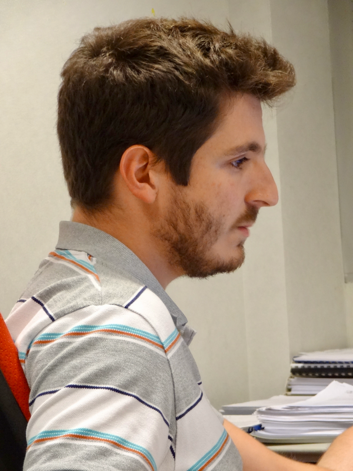

```{r identity-table, echo=FALSE, message=FALSE, out.extra='style="float: left; width: 80%; padding: 10px;"'}
library(tidyverse)
library(kableExtra)
identity_keys <- cell_spec(
  x = c(
  "Title", 
  "E-mail", 
  "Phone", 
  "Address", 
  "Office on campus", 
  "Academic status", 
  "Field expertise", 
  "CNRS Status", 
  "Team"
), format = "html", bold = TRUE)
identity_values <- c(
  "Ph.D.", 
  cell_spec("aymeric.stamm@math.cnrs.fr", format = "html", link = "mailto:aymeric.stamm@math.cnrs.fr"), 
  "+33 (0)2 51 12 59 84", 
  "Department of Mathematics Jean Leray\\\nNantes University\\\n2 Chemin de la Houssinière\\\nBP 92208\\\n44322 Nantes Cedex 3, France", 
  "Building 10, 1st floor, Room 115", 
  "Research engineer", 
  "Expert in statistical information", 
  "ITA/IATOSS", 
  cell_spec("ALEA", format = "html", link = "https://www.math.sciences.univ-nantes.fr/fr/equipe/alea")
)
tibble(
  keys = identity_keys, 
  values = identity_values, 
) %>% 
  kbl(
    format = "html", 
    booktabs = TRUE, 
    escape = FALSE, 
    col.names = NULL
  ) %>% 
  kable_styling(bootstrap_options = c("hover", "condensed"))
```

```{r identity-pic, echo=FALSE, out.width="20%", out.extra='style="float: right; width: 20%; padding: 10px;"', layout="l-body side"}

```

## Research interests

**Theoretical Statistics**

-   Inference for constrained high-dimensional data
-   Clustering of constrained high-dimensional data

**Applied Statistics**

-   Diffusion MRI
-   Multiple Coil MRI
-   Brain microstructure imaging

**Computational Statistics**

-   Open-source efficient programming with the R language

## Biography

I work as a research engineer in statistics at the National Center of
Scientific Research (CNRS) in France. I am attached to the Mathematic
Department Jean Leray, a joint CNRS and Nantes University laboratory in
Nantes, France. I am also a research fellow at the Computational
Radiology Laboratory (CRL) affiliated to the Department of Radiology of
Boston Children's Hospital and Harvard Medical School, MA, USA.

I am an experienced statistician with focus on (i) the development of
novel statistical methodologies for complex image analysis, with
extensive but not exclusive application to magnetic resonance imaging of
the brain and (ii) the extension of traditional statistical methods
(estimation, inference, classification, regression) to the analysis of
complex data (functions, Hilbertian, tensors, networks, densities, ...).

I am also a research engineer with particular interest in making methods
and algorithms developed in research labs available for use by a broader
audience of applied fields. I am the author of several R packages
available from my Github page (<https://github.com/astamm>).

I was awarded a B.Sc. degree in mathematical engineering from Ecole
Centrale de Lyon (France) and a M.Sc. degree in mathematical engineering
with major in statistics from Politecnico di Milano (Italy). During the
course of my M.Sc., I collaborated with Dept. of Mathematics "F.
Brioschi" (MOX) of the Politecnico di Milano and became co-investigator
of the 2-year "Pn project" (2009-2010), whose objectives were to enable
statistical inference from high-dimensional data. After my M.Sc., I
obtained a Ph.D. degree in computer science. My Ph.D. focused on the
development and application of statistical models for the study of the
brain white matter microstructure and connectivity. During my first
post-doctoral appointment at Harvard Medical School, I developed a
statistical framework for MR image reconstruction that guarantees
unbiasedness of the resulting composite complex MR image. I then joined
again the Department of Mathematics of Politecnico di Milano where I
pursued the development of novel statistical methodologies for complex
image analysis and developed inferential tools for populations of
densities and networks.

Simultaneously, I have been collaborating with the Dept. of
Neuroradiology of the University Hospital of Rennes (France), since the
beginning of my Ph.D., and with Dept. of Radiology of BCH (USA), since
the beginning of my first post-doctoral appointment, to provide guidance
on designing experiments and reviewing interim data, and to advise PIs
of most of the Dept. projects on all statistical analysis methods and
model development required in their projects. During my Ph.D., I also
worked as a biostatistician at the Dept. of Epidemiology and Public
Health of the University Hospital of Rennes (France) where I was in
charge of the statistical analyses of several health-related projects
(e.g., multiple sclerosis, practice of oral care in palliative care
units).

## Projects

```{r project-table, echo=FALSE, message=FALSE}
library(tidyverse)
library(kableExtra)
projects <- c(
  "MS-CSI", 
  "The H2C Project", 
  "The Large P small n Project"
)
projects_url <- c(
  "./ms-csi.html", 
  "./h2c.html", 
  "./large-p-small-n.html"
)
role <- c(
  "Principal Investigator", 
  "Principal Investigator", 
  "Associate Investigator"
)
partners <- c(
  "CNRS (French National Center for Scientific Research)\\\nUniversity Hospital of Nantes\\\nINRIA\\\nUniversity Hospital of Rennes\\\nNantes University", 
  "Politecnico di Milano", 
  "Politecnico di Milano\\\nUnversité de Rennes I\\\nEmory University"
)
financers <- c(
  "ARSEP (French Association for Research on Multiple Sclerosis)", 
  "PoliMi International Fellowships (PIF) - Politecnico di Milano", 
  "5x1000 Donations - Politecnico di Milano"
)
dates <- c(
  "June 2019 - Dec. 2022 (to be modified)", 
  "Sept. 2015 - Dec. 2018", 
  "Nov. 2011 - Dec. 2013"
)
tibble(
  Name = cell_spec(
    x = projects, 
    format = "html", 
    link = projects_url
  ), 
  Role = role, 
  Partners = partners, 
  Financers = financers, 
  Dates = dates
) %>% 
  kable("html", booktabs = TRUE, escape = FALSE) %>% 
  kable_styling(bootstrap_options = c("hover", "condensed"))
```
