## Team members 

:::: {.columns}

::: {.column width="20%"}
{width="150px"}

::: {style="margin-top: -30px;"}
[**Konrad A.**](https://www.umu.se/en/staff/konrad-abramowicz/){.small}
:::

:::

::: {.column width="20%"}
{width="113px"}

::: {style="margin-top: -30px;"}
[**Alessia P.**](https://alessiapini.github.io){.small}
:::

:::

::: {.column width="20%"}
{width="113px"}

::: {style="margin-top: -30px;"}
[**Lina S.**](https://www.umu.se/en/staff/lina-schelin/){.small}
:::

:::

::: {.column width="20%"}
{width="113px"}

::: {style="margin-top: -30px;"}
[**Sara S.d.L.**](https://www.umu.se/en/staff/sara-sjostedt-de-luna/){.small}
:::

:::

::: {.column width="20%"}
{width="138px"}

::: {style="margin-top: -30px;"}
[**Simone V.**](https://scholar.google.com/citations?user=Cy2mv3YAAAAJ&hl=it){.small}
:::

:::

::::

::: {style="font-size: 0.7em; margin-top: 1em;"}
| | |
|:-----|:----------------------------------------------------------------|
| **K. Abramowicz, S. Sjöstedt de Luna** | Dept. of Mathematics and Mathematical Statistics, Umeå University, Sweden |
| **L. Schelin** | Dept. of Statistics, Umeå School of Business, Economics and Statistics, Umeå University, Sweden |
| **A. Pini** | Dept. of Statistical Sciences, Università Cattolica del Sacro Cuore, Milan, Italy |
| **S. Vantini** | MOX, Dept. of Mathematics, Politecnico di Milano, Milan, Italy |

: {tbl-colwidths="[30,70]"}
:::

# Context {.section-slide}

## Problem formulation {.small-slide}

Functional data on $L^2(D) \cup \mathcal{C}^0(D)$, where $D \subset \mathbb{R}^d$.

A null hypothesis $H_0^t$ which is true on a subset $D_0 \subseteq D$ and false on $D_1 = D \setminus D_0$.

[Aim]{.fg}: estimate $D_0$ by testing [locally]{.fg} $H_0^t$ against $H_1^t$.

::: {.callout-example}

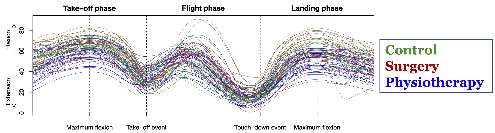{width="70%" fig-align="center" .lightbox}

$$
\small{
y_i(t) = \beta_0(t) + \beta_\mathrm{Jump}(t) x_{\mathrm{Jump},i} + \beta_\mathrm{R}(t) x_{\mathrm{R},i} + \beta_\mathrm{PT}(t) x_{\mathrm{PT},i} + \varepsilon_i(t), \quad i = 1, \dots, 95
}
$$

$$
\small{
H_0: \beta_\mathrm{PT}(t) = 0 \quad \text{for all } t \in D \quad \text{vs.} \quad H_1: \beta_\mathrm{PT}(t) \neq 0 \quad \text{for some } t \in D
}
$$

:::

## Null hypothesis testing in FDA

::: {.r-stack}
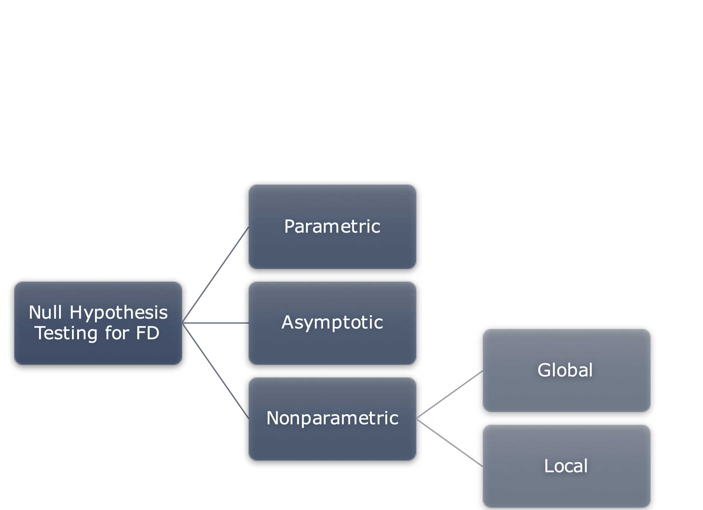{width="70%" fig-align="center"}

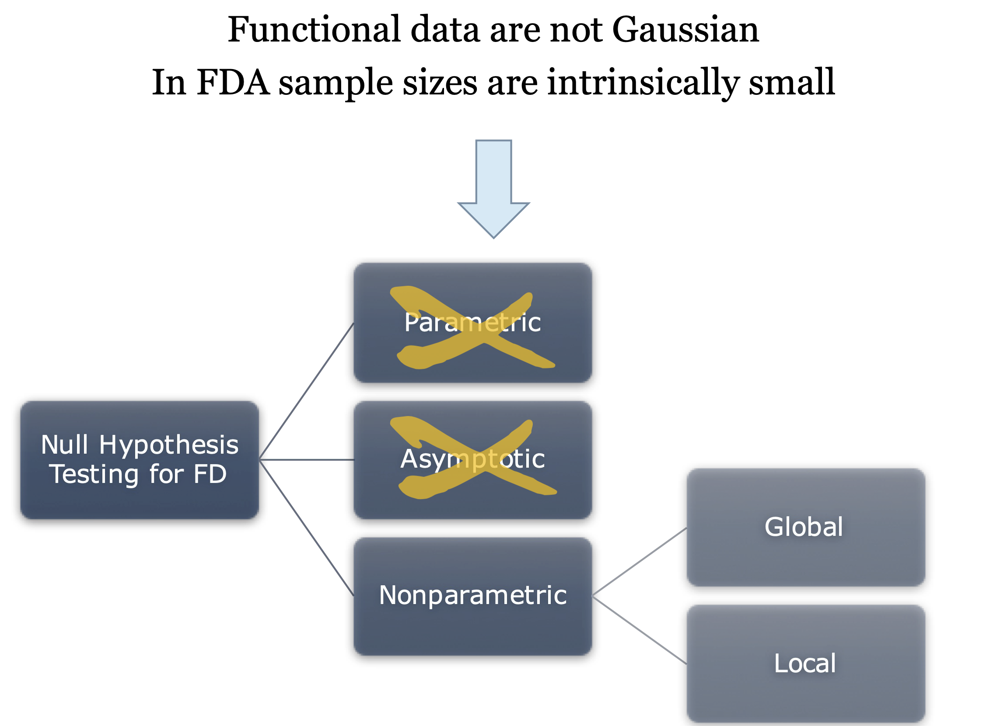{.fragment width="70%" fig-align="center"}

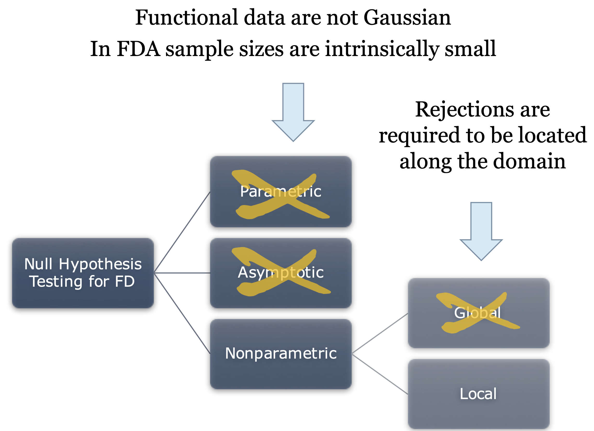{.fragment width="70%" fig-align="center"}
:::

## Pointwise testing

Straightforward solution: a statistical test for each point of the domain

::: {.r-stack}

::: {.fragment .fade-out fragment-index=1}
![P-values from permutations of residuals [@freedman1983significance].](images/pointwise_testing_1.png){width="70%" fig-align="center"}
:::

::: {.fragment .fade-in-then-out fragment-index=1}
![[Multiplicity issue: no control of $\mathbb{P}$(no false rejection).]{.alert}](images/pointwise_testing_2.png){width="70%" fig-align="center"}
:::

::: {.fragment fragment-index=2}
![[Multiplicity issue: no control of $\mathbb{P}$(no false rejection).]{.alert}](images/pointwise_testing_3.png){width="70%" fig-align="center"}
:::

:::

## What is the multiplicity issue?

::: {.definition}
### Definition 1 (Familywise error rate)

The [familywise error rate]{.fg} (FWER) is the probability of making at least one false rejection among a family of tests.
:::

::: {.problem}
For $m$ stochastically independent tests at level $\alpha$, among which $m_0$ are true null hypotheses, the FWER can be expressed as:
$$
\text{FWER} = 1 - (1 - \alpha)^{m_0} \to 1 \quad \text{as } m_0 \to \infty \text{ when } \alpha \in (0,1].
$$
:::

# Unified framework for multiple testing in FDA {.section-slide}

## Functional control of the FWER {.small-slide}

::: {.definition}
### Definition 2 (Weak control of the FWER)
A procedure for locally testing -- over the domain $D$ -- a null hypothesis $H_0^t$ against an alternative $H_1^t$, $\forall t \in D$, is provided with [weak control of the FWER]{.underline} if the adjusted p-value $\widetilde{p}(t)$ is such that for all $\alpha \in (0,1)$:

$$
H_0^{D_\phantom{0}} \mbox{ is true } \Longrightarrow \mathbb{P}(\exists t \in D : \widetilde{p}(t) \le \alpha) \le \alpha.
$$
:::

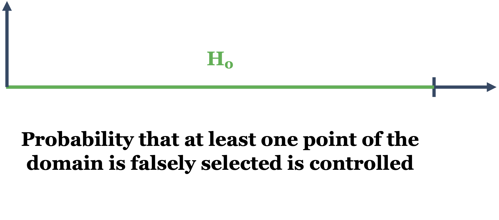{width="60%" fig-align="center" style="margin-top: -1em;"}

## Functional control of the FWER {.small-slide}

::: {.definition}
### Definition 3 (Strong control of the FWER)
A procedure for locally testing -- over the domain $D$ -- a null hypothesis $H_0^t$ against an alternative $H_1^t$, $\forall t \in D$, is provided with [strong control of the FWER]{.underline} if the adjusted p-value $\widetilde{p}(t)$ is such that:

$$
\forall A \subseteq D \text{ s.t. } H_0^A \text{ is true } \Rightarrow \mathbb{P}(\exists t \in A : \widetilde{p}(t) \le \alpha) \le \alpha, \quad \text{for all } \alpha \in (0,1).
$$
:::

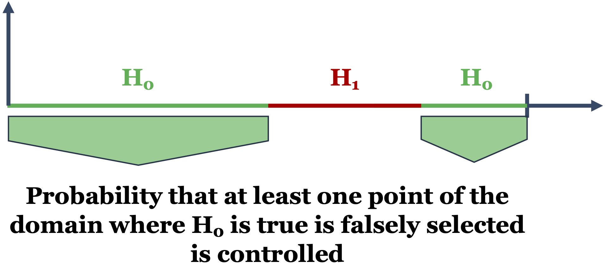{width="60%" fig-align="center" style="margin-top: -1em;"}

## Closed Testing Procedure in MDA {.small-slide}

::: {.definition}
### Definition 4: Closed testing [@marcus1976closed]

The closed testing procedure is a multiple testing method where a null hypothesis $H_0^{(i)}$ is rejected at level $\alpha$ if [every intersection hypothesis]{.fg} that contains $H_0^{(i)}$ is rejected at level $\alpha$.
:::

::: {.columns}

::: {.column width="65%"}

::: {.center}
```{mermaid}
graph TD
    H123["$$H_0^{(123)}: \left( \theta_1, \theta_2, \theta_3 \right) = \left( \theta_1^0, \theta_2^0, \theta_3^0 \right)$$"]

    H12["$$H_0^{(12)}: \left( \theta_1, \theta_2 \right) = \left( \theta_1^0, \theta_2^0 \right)$$"]
    H13["$$H_0^{(13)}: \left( \theta_1, \theta_3 \right) = \left( \theta_1^0, \theta_3^0 \right)$$"]
    H23["$$H_0^{(23)}: \left( \theta_2, \theta_3 \right) = \left( \theta_2^0, \theta_3^0 \right)$$"]

    H1["$$H_0^{(1)}: \theta_1 = \theta_1^0$$"]
    H2["$$H_0^{(2)}: \theta_2 = \theta_2^0$$"]
    H3["$$H_0^{(3)}: \theta_3 = \theta_3^0$$"]

    H123 --> H12
    H123 --> H13
    H123 --> H23
    H12 --> H1
    H12 --> H2
    H13 --> H1
    H13 --> H3
    H23 --> H2
    H23 --> H3

    style H123 fill:#4a90d9,color:#fff
    style H12 fill:#7ab3e0,color:#fff
    style H13 fill:#7ab3e0,color:#fff
    style H23 fill:#7ab3e0,color:#fff
    style H1 fill:#a8d1f0,color:#333
    style H2 fill:#a8d1f0,color:#333
    style H3 fill:#a8d1f0,color:#333
```
:::

:::

::: {.column width="35%"}

[In terms of adjusted p-values, the closed testing procedure can be expressed as:]{.small}

[$$ \widetilde{p}_1 = \max \left\{ p^{(1)}, p^{(12)}, p^{(13)}, p^{(123)} \right\} $$]{.small}

:::

:::

## Extensions to functional data

::: {.idea}
### FWER-adjusted p-value function [@abramowicz2023domain]

$$
\widetilde{p}(t) = \sup_{A \subseteq D \, : \, t \in A} \left\{ p^A \right\}
$$
:::

::: {.fragment .fade-in}

::: {.fragment .semi-fade-out}

::: {.idea}
### FDR-adjusted p-value function [@olsen2021false]

$$
\widetilde{p}(t) = \min_{s \ge p(t)} \left\{ 1, \frac{\mu(D) \cdot s}{\mu(\{r : p(r) \le s\})} \right\} \quad \text{(Benjamini-Hochberg)}
$$
:::

:::

:::

## Unified framework for FWER control in FDA

::: {.r-stack}

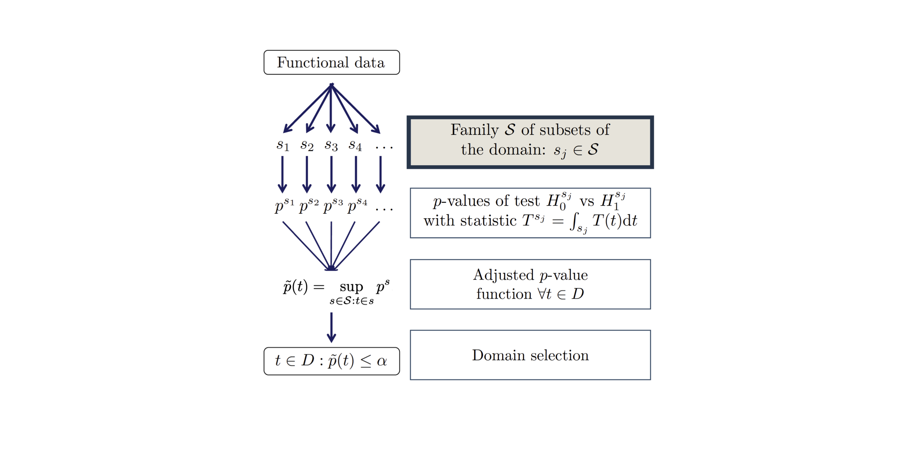{width="100%" fig-align="center"}

{.fragment width="100%" fig-align="center"}

:::

## Global Testing [^global] {.small-slide}

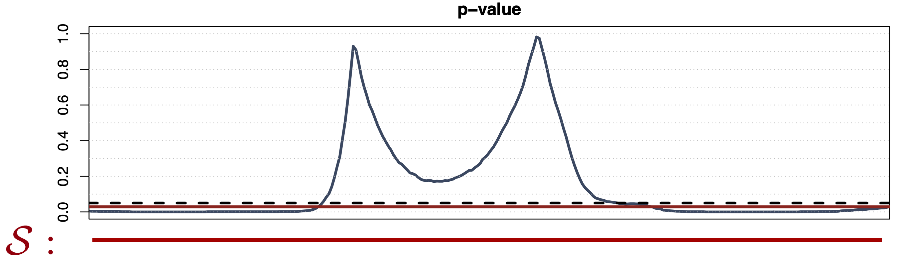{width="900px" fig-align="center"}

- Predefined family [$\mathcal{S} = \{D\}$]{color="#c00000"}
- Weak control of the FWER
- No domain selection (i.e., [$\widetilde{p}(t)$]{color="#c00000"} $\equiv \mathrm{const}$)
- Computationally efficient (one test)

[^global]: @hall2002permutation, @pini2018hotelling .

## Borel-Wise Testing [^borel] {.small-slide}

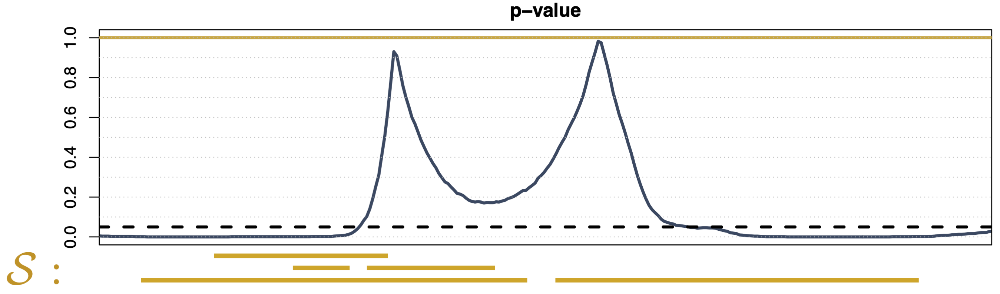{width="900px" fig-align="center"}

- Predefined family [$\mathcal{S} = \mathcal{B}(D)$]{color="#dda60e"}
- Strong control of the FWER
- No domain selection (i.e., [$\widetilde{p}(t)$]{color="#dda60e"} $\equiv \mathrm{const} \ge \max \{p(t) : t \in D\}$)
- Computationally inefficient ($2^p$ tests for a grid of $p$ points)

[^borel]: @marcus1976closed .

## Partition-Closed Testing [^pct] {.small-slide}

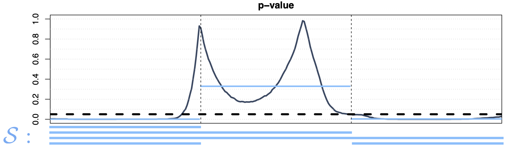{width="900px" fig-align="center"}

- Predefined family [$\mathcal{S} = \sigma(\{S_j\}_{j=1}^J)$]{color="#71bffc"}, with $\{S_j\}_{j=1}^J$ a partition of $D$
- Strong between-set control, weak within-set control of the FWER
- Subset selection (i.e., [$\widetilde{p}(t)$]{color="#71bffc"} $= p^{S_j}$ for $t \in S_j$)
- Computationally inefficient if $J$ is high ($2^J$ tests)

[^pct]: @vsevolozhskaya2013combining, @vsevolozhskaya2014pairwise .

## Partition-Closed Testing [^pct] {.small-slide}

::: {.r-stack}

::: {.fragment .fade-out fragment-index=1}
{width="900px" fig-align="center"}
:::

::: {.fragment .fade-in-then-out fragment-index=1}
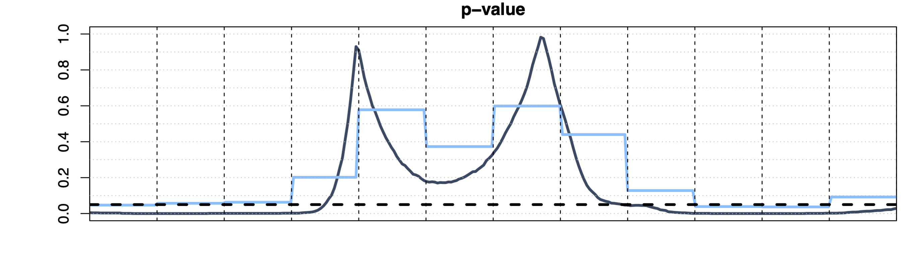{width="900px" fig-align="center"}
:::

::: {.fragment fragment-index=2}
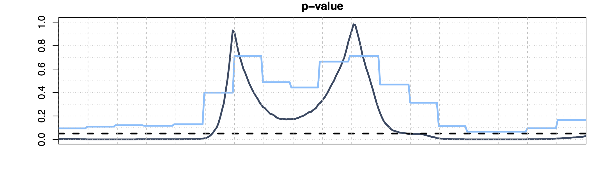{width="900px" fig-align="center"}
:::

:::

- Predefined family [$\mathcal{S} = \sigma(\{S_j\}_{j=1}^J)$]{color="#71bffc"}, with $\{S_j\}_{j=1}^J$ a partition of $D$
- For $J$ going to infinity, PCT = BWT: 

[$\lim_{J \to \infty}$ [$\widetilde{p}_J^\mathrm{PCT}(t)$]{color="#71bffc"} $=$ [$\widetilde{p}^\mathrm{BWT}(t)$]{color="#dda60e"}.]{.center}

## Interval-Wise Testing [^iwt] {.small-slide}

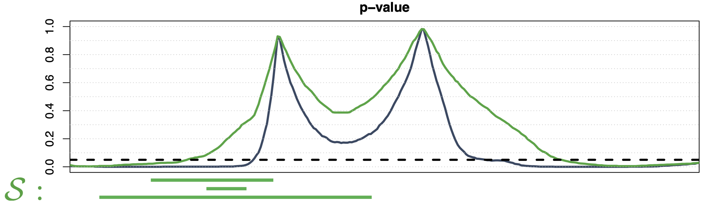{width="900px" fig-align="center"}

- Predefined family [$\mathcal{S} = \{[t_1^l, t_1^r] \times \dots \times [t_d^l, t_d^r] : t_i^l \le t_i^r, i \in [\![ 1,d ]\!] \}$]{color="#02b04f"}
- Strong control if $D_0$ is a Cartesian product of intervals, weak control otherwise;
- Domain selection (i.e., [$\widetilde{p}^\text{IWT}(t)$]{color="#02b04f"} is a continuous function)
- Computationally inefficient for large $d$ ($p^{2d}$ tests)

[^iwt]: @pini2017interval, @pini2018domain, @abramowicz2018nonparametric .

## Threshold-Wise Testing [^twt] {.small-slide}

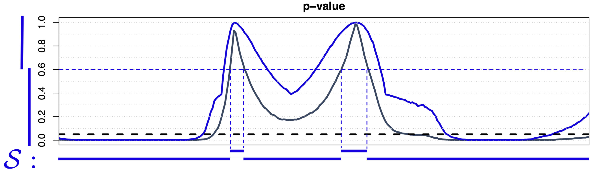{width="900px" fig-align="center"}

- Data-driven family [$\mathcal{S} = \{ \{t : p(t) \le s\}, \{t : p(t) > s\}, s \in [0,1] \}$]{color="#1300e5"}
- Strong control asymptotically, finite weak control
- Domain selection (i.e., [$\widetilde{p}^\text{TWT}(t)$]{color="#1300e5"} is a continuous function)
- Computationally efficient for any $d$ ($2m$ tests, with $m$ the discretization step of $[0,1]$)

[^twt]: @abramowicz2023domain .

# A more complex example {.section-slide}

## Brain microstructure mapping

- Diffusion MRI: sensitive to diffusion of water molecules in the brain;
- Diffusion [model]{.fg}: locally describes parametrically the diffusion pattern.

![Many cell populations impact the diffusion signal in a voxel [@novikov2019quantifying] $\Rightarrow$ many models in literature [@panagiotaki2012compartment].](images/brain_microstructure.png){width="100%" fig-align="center"}

## Brain structural connectivity mapping

![Partial connectivity reconstruction from two models [@jin2019differences].](images/brain_connectivity.png){width="100%" fig-align="center"}

- Pyramidal tract (green): motor function
- Arcuate fasciculus (red): language function
- Corpus callosum (blue): interhemispheric communication

## Conducted study {.small-slide}

- Lesions = axonal damage $\Rightarrow$ drop in fractional anisotropy (FA).
- Study the FA of healthy subjects along the corpus callosum (CC).
- Compare FA stability along CC when two diffusion models are applied:

::: {.columns}

::: {.column width="50%"}

![[M1]{.fg}: Single 3D Gaussian distribution.](images/brain_cc_m1.png){width="80%" fig-align="center"}

:::

::: {.column width="50%"}

![[M2]{.fg}: Mixture of M1 + isotropic 3D Gaussian distribution (accounts for free water).](images/brain_cc_m2.png){width="80%" fig-align="center"}

:::

:::

## Results {.small-slide}

- We applied TWT to test differences in FA variance between M1 and M2;

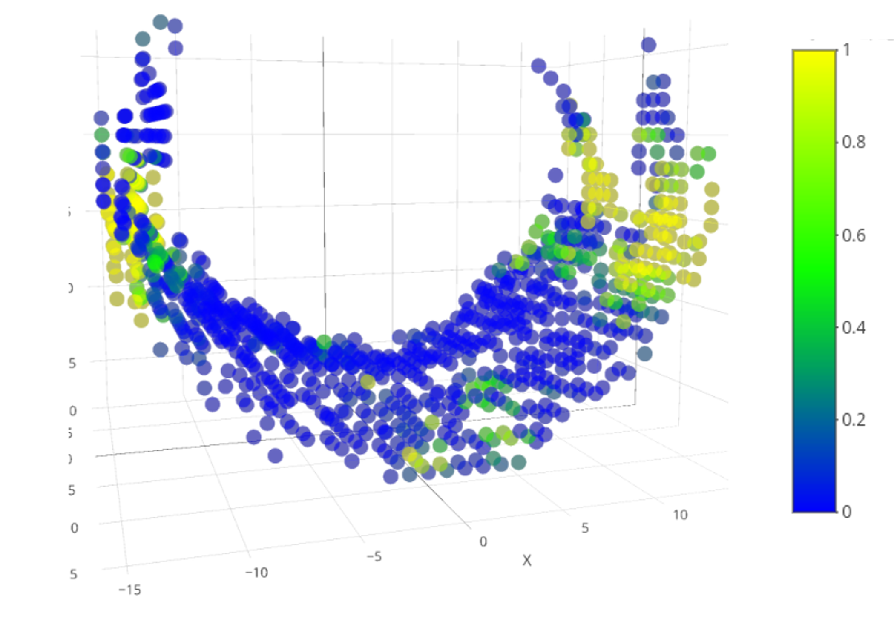{width="100%" fig-align="center"}

- We found significantly lower FA variance when using M2 compared to M1;
- Non-significant regions correspond to areas of the CC that cross with pyramidal tract and arcuate fasciculus $\Rightarrow$ both models are misspecified in these regions.

# Software {.section-slide}

## Implementation: the R package [{fdatest}](https://permaverse.github.io/fdatest/)

::: {.achieved}
- Initial release following IWT publication [@pini2017interval].
- On CRAN: <https://cran.r-project.org/package=fdatest>
- Implements IWT for:

  - One-sample problems;
  - Two-sample problems;
  - Functional ANOVA;
  - Functional regression.

- Compatible with the [{fda}](https://cran.r-project.org/package=fda) package.
:::

## Implementation: the R package [{fdatest}](https://permaverse.github.io/fdatest/)

::: {.todo}
- [ ] Implementation of the global test, BWT, PCT and TWT.
- [ ] Compatibility with the [{funData}](https://cran.r-project.org/package=funData) package.
- [ ] Code factorization and optimization.
- [ ] Unit tests and documentation.

Almost done in branch [`astamm/fdatest@clean-doc`](https://github.com/astamm/fdatest/tree/clean-doc), which you can try out by installing the package from GitHub:

```r
# pak::pak("remotes")
remotes::install_github("astamm/fdatest@clean-doc")
```
:::

## The [permaverse](https://github.com/orgs/permaverse/repositories)

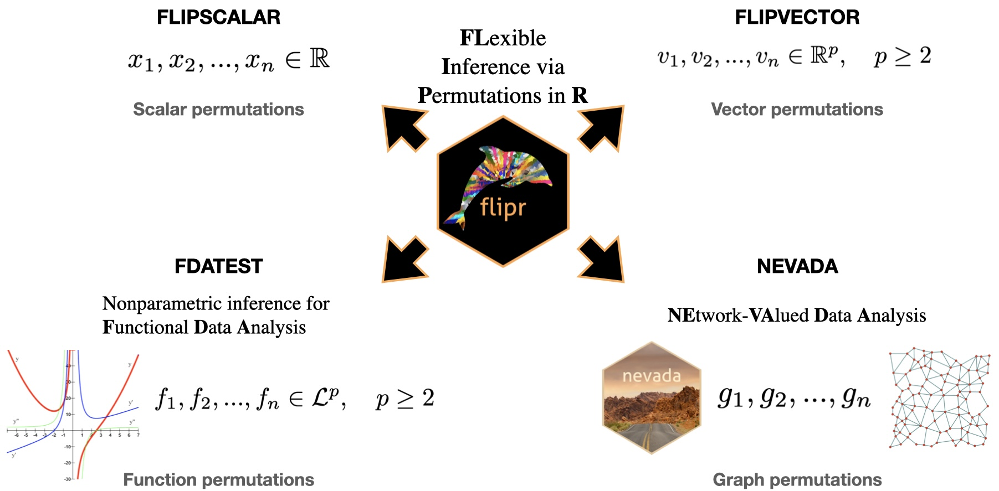{width="100%" fig-align="center"}

## References

::: {#refs .references}
:::